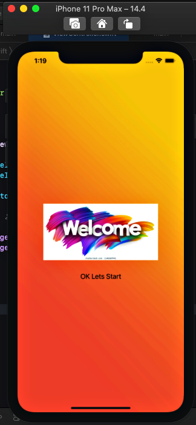
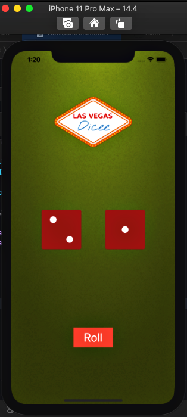
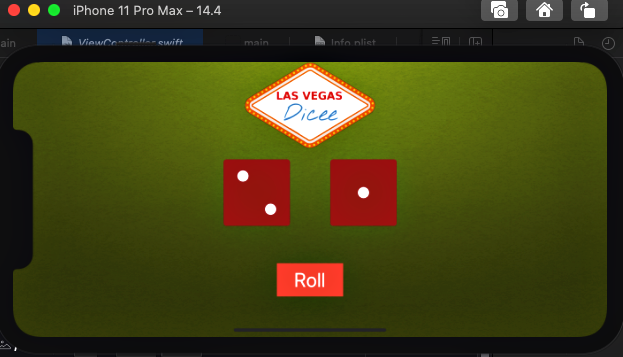

# Dicee

## What I Made

It's a simple Las Vegas dice app. You can make the dice roll at the press of a button or by shaking  phone. With this app, you’ll be fully set up to settle any score on the go!

## What I learned for making this

* Create an app with behaviour and functionality.
* Create links between the Interface Builder files and code using IBActions and IBOutlets.
* * Learn to use comments to annotate code.
* Understand and use Swift constants and variables.
* Understand and use collection types such as Swift arrays.
* How to clone an existing Xcode project from GitHub.
* Get familiar with the Xcode code editor.
* Test and debug an app with the Xcode console.
* Learn about randomisation and how to generate random numbers in Swift.

## ScreenShot

